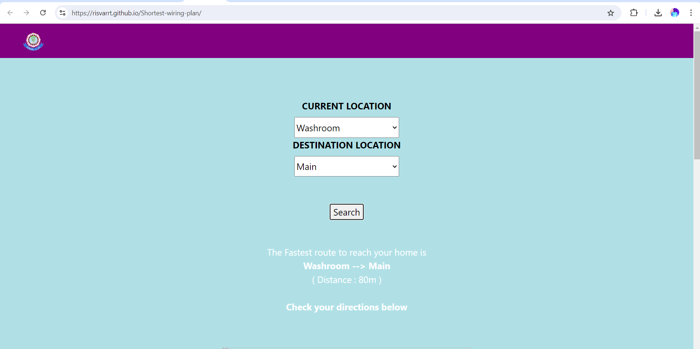
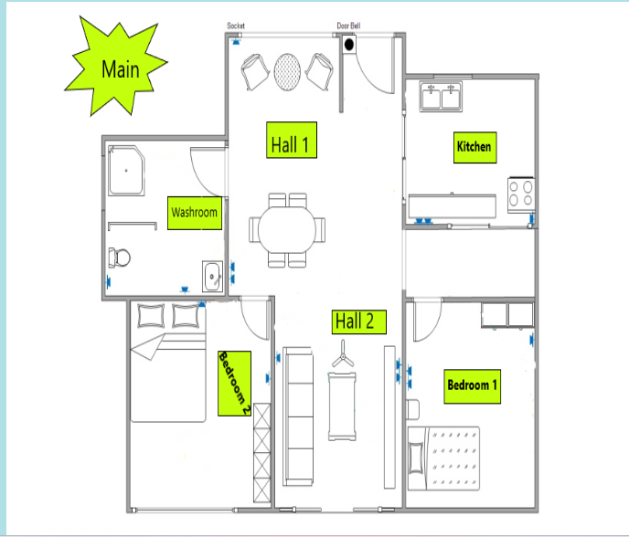
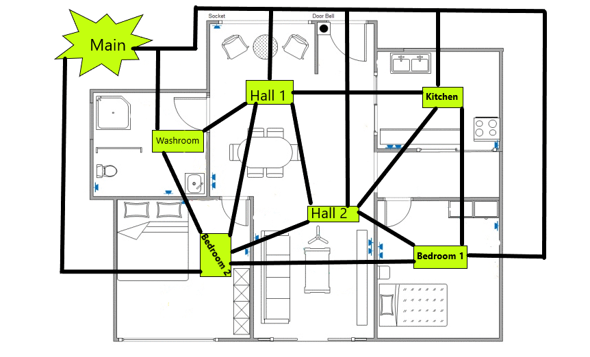

# Shortest Wiring Plan

This project is a solution for finding the shortest wiring plan in a given setup. The main objective is to connect various points in a space with the minimal amount of wiring, ensuring an efficient and cost-effective layout.

## Project Links

- **Repository**: [Shortest Wiring Plan](https://github.com/risvarrt/Shortest-wiring-plan)

## Features

- **Optimal Wiring**: Automatically calculates the shortest wiring path between multiple points.
- **Visualization**: Provides a visual representation of the wiring plan.
- **Customization**: Users can add or remove points to customize the wiring plan.

## Screenshots

### Wiring Plan Visualization





## How to Use

1. **Clone the repository**:
   ```bash
   git clone https://github.com/risvarrt/Shortest-wiring-plan.git
   ```
2. **Open the index.html file in your browser** to start visualizing the wiring plan.

## Technical Details

### Tech Stack

- **HTML5**: The structure of the web pages is built using HTML.
- **CSS3**: The styling of the web pages is done using CSS, ensuring a clean and responsive design.
- **JavaScript (ES6)**: 
  - **Core Logic**: The wiring logic, including the shortest path calculation, is implemented in JavaScript.
- **GitHub Pages**: The project is hosted on GitHub Pages, making it easily accessible online.

### Project Structure

- **index.html**: The main page where users can visualize the shortest wiring plan.
- **style.css**: Contains all the CSS styles used across the web pages.
- **script.js**: Contains the logic for calculating the shortest wiring plan and rendering the visualization.
- **assets/**: This folder contains the images and other assets used in the project.

### Dijkstra's Algorithm Overview

The core of this project relies on **Dijkstra's Algorithm** to compute the shortest wiring plan. Dijkstra's Algorithm is a well-known algorithm for finding the shortest paths between nodes in a graph, which may represent, for example, road networks, communication systems, or in this case, wiring layouts.

### How it Works:

- **Graph Representation**: Each point in the wiring plan is treated as a node in a graph, and the possible wiring connections between these points are treated as edges with weights representing the distance or cost.
- **Algorithm Execution**: Dijkstra's Algorithm works by starting from an initial node and exploring all the possible paths, always choosing the path with the smallest cumulative cost until all nodes have been visited. This ensures that the shortest path from the starting point to every other point is found.
- **Optimal Wiring Path**: The result of Dijkstra's Algorithm is used to determine the optimal wiring layout that minimizes the total length of the wiring required.

### Key Functions

- **calculateShortestPath(points)**: Computes the shortest wiring path connecting all the given points using Dijkstra's Algorithm.
- **renderVisualization(canvas, points)**: Renders the visual representation of the wiring plan on the canvas, showing the optimal wiring connections.
